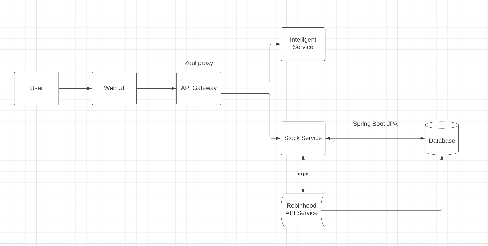

# **Intelligent Trading Platform**

## Introduction

Intelligent Trading Platform is a Robinhood support stock trading platform with include intelligent consultant and auto-trading functionality. 

## Architecture Diagram

#### API Gateway:
Use Spring Cloud API Gateway to reach out either Intelligent Service or Stock Service.

#### Intelligent Service: 
Based on prediction model built by ML training algorithms, all algorithms simulation will use the data Yahoo API provided as resource. The service use Flask to create the RESTful API. It will return the prediction analysis graph and predicted price of target date which Robinhood users requested. User should enter the target stock ticker, the date you want to download data from and the date you want to see the prediction. Both start and end date must be in format XXXX-XX-XX. Eventually it will represent a prediction plot and the predicted price according to the data in last 60 days.

#### Stock Service: 
Support Robinhood customers buy and sell any stock manually or automatically, User can view currently stock status you holding and buy or sell. Meanwhile, User can set an automatic buy and sell in a particular price. 