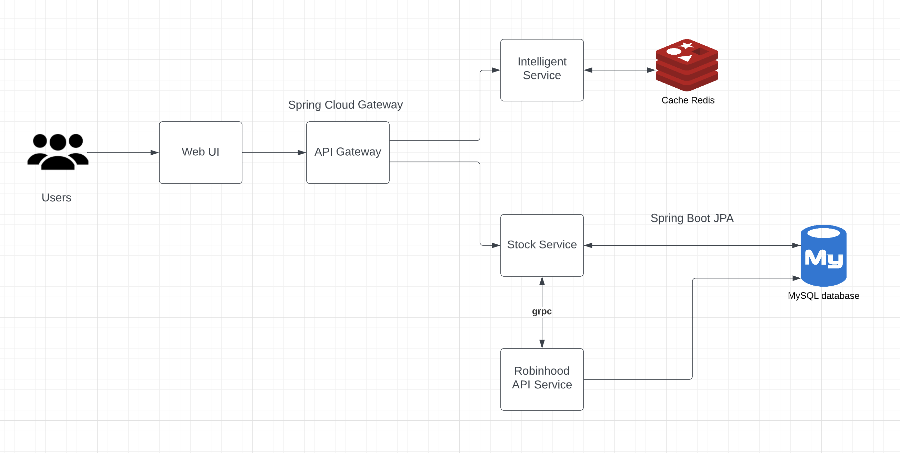

# **Intelligent Trading Platform**

## Introduction

Intelligent Trading Platform is a Robinhood support stock trading platform with include intelligent consultant and auto-trading functionality. 

## Architecture Diagram

#### API Gateway:
Use Spring Cloud API Gateway to reach out either Intelligent Service or Stock Service.

#### Intelligent Service: 
Based on prediction model built by ML training algorithms, all algorithms simulation will use the data Yahoo API provided as resource. The service use Flask to create the RESTful API. It will return the prediction analysis graph and predicted price of target date which Robinhood users requested. User should enter the target stock ticker, the date you want to download data from and the date you want to see the prediction. Both start and end date must be in format XXXX-XX-XX. Eventually it will represent a prediction plot and the predicted price according to the data in last 60 days. Once User enter the stock ticker, the start date user request the data retrieve from, the date to predict, they will temporarily be stored in redis cache, they will eventually be obtained when page has been redirected to the result page.

#### Stock Service: 
Support Robinhood customers buy and sell any stock manually or automatically, User can view currently stock status you're holding and trade as well. Meanwhile, User can set an automatic buy and sell in a particular price. Stock Service as a grpc client send the request to Robinhood API Service. Once receive the response from server will be represented in UI in the Service.
One case a little complex is Auto trading. Here is how autobuy works:

Stopbuy page will represent a table which threads_buy currently stored. Auto-Sell has the similar mechanism as Auto-Buy. Only difference is auto-sell will try to get the holds to ensure the user is holding some amounts of the required stock before it triggered.

#### Robinhood API Service
Provide the Robinhood API to Stock Service, most API it provided is implemented by Robinhood Open API, it works as grpc server to process the request send from Stock Service.

#### Database
Use MySQL to store the username and password, once user first time to register their robinhood username and password in Robinhood-Api-Service, it will automatically stored in DB, after that it will keep verify username and password based on User information registered in DB.

## Installation and Environmental Setup

Before you start, please confirm you have installed Docker Desktop in your local machine.
Here is the link for Docker Desktop installation: https://docs.docker.com/desktop/

You can run `build.sh` in each module to create a docker container, Please notice, because container has no OS, it must rely on the OS of your local machine.
Please review all `.properties` and `build.sh` files in each module, if you see any host or parameter address has been set as 192.168.1.67, you should change it to IP address of your local machine.
Otherwise, `docker-compose.yml` can up all services under itp, you can replace all '192.168.1.67' to your local IP then run command to start all services simultaneously:

`docker-compose up -d`.

Everytime you start a new container for Robinhood-Api-Service. Please remember to register your Robinhood username and password.
To do this you should run the execution command in docker container terminal:  
`python3 registerDevice.py`

*NOTICE: Before you do register or login, please confirm that you already disabled the 2FA of your Robinhood account. Here is a brief instruction:

After you enter your Robinhood username and password, `Enter Robinhood code for validation:` will show in terminal, the SMS code will send to your phone. 
You have three chances to enter the correct code for validation. Once the device has done the validation,
username and password will be stored in Database _login_table_. It will be used to verify your login in Stock Service.

