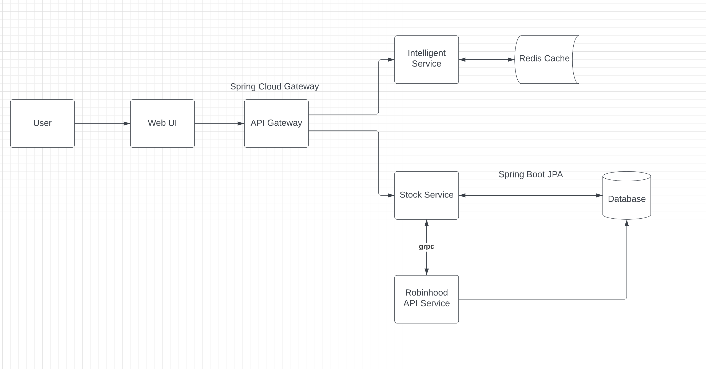

# **Intelligent Trading Plateform**

## Introduction

Intelligent Trading platform is a stock trading platform with include intelligent consult and auto-trading functionality.

## Architecture Diagram

#### API Gateway:
Use Zuul proxy to reach out the port Service Registry occupied.

#### Intelligent Service: 
Based on prediction model built by ML training algroithms, all algroithms simulation will use the data Yahoo API provided as resource. It will return the prediction analysis graph and recommendations of best time sell and buy for all stocks Robinhood customers have everyday. Recommendation Service will fetch the stocks Robinhood customers have from database. Then process the qualitative trading algroithms it has and finally send the list of recommed time to buy and sell to Stock service through grpc.

#### Stock Service: 
Support Robinhood customers buy and sell any stock manually or automatically, will page will show currently stock status you holding and recommendation of best time to sell and buy everyday. Meanwhile, we can set an automatic buy and sell in a particular price. Once any manipulation we made, our stock holding status will also be stored in database